# Hi, I'm Souvik Ghosh 👋

**Systems & backend engineer** — I build low-level infrastructure from scratch: consensus protocols, LLM inference servers, and distributed tracing platforms. Currently pursuing a B.Tech in Computer Science at **IIEST Shibpur** (CGPA 8.67, expected 2027) and interning as a **Software Engineering Intern at Accenture**.

I like problems where correctness and performance both matter — the kind you validate with fault injection and benchmark under load.

---

### 🔧 What I work on

- **Distributed systems** — Raft consensus, quorum replication, linearizable reads
- **AI infrastructure** — transformer inference, PagedAttention KV-caches, CUDA/Triton kernels
- **Observability** — OpenTelemetry ingestion, tail-based sampling, high-throughput storage
- **Backend & cloud** — Go, Python, Java services on OCI/AWS/GCP with real SLOs

---

### 🚀 Featured Projects

**[RaftKV](https://github.com/souvikDevloper/RaftKV) — Distributed Key-Value Store** · `Go · Raft · gRPC · BoltDB · Docker`
Implemented the Raft consensus protocol from scratch: leader election, log replication, snapshotting, and a durable BoltDB write-ahead log. Lease-based linearizable reads tolerating ⌊(N−1)/2⌋ node failures, validated across 50+ fault scenarios with a Jepsen-style checker — zero safety violations. **51.2K ops/sec, 1.63 ms p99** on a 5-node cluster (YCSB-C).

**[InferEngine](https://github.com/souvikDevloper/InferEngine) — LLM Inference Server** · `Python · PyTorch · CUDA · Triton`
OpenAI-compatible transformer inference server with continuous batching, streaming generation, and a PagedAttention-style KV-cache. Scheduler dynamically merges prefill/decode phases; custom Triton fused-QKV kernel. **Within 1.18% of vLLM throughput** on Qwen2.5-7B (A100) — 975.8 vs 987.4 tok/s at comparable p99 latency.

**[TraceFlow](https://github.com/souvikDevloper/TraceFlow) — Observability & Tracing Platform** · `Go · OpenTelemetry · gRPC · ClickHouse`
OpenTelemetry-compatible trace ingestion backend with W3C context propagation and batched ClickHouse persistence. Tail-based sampling keeps 100% of error/slow traces while dropping 93.76% of healthy traffic. **128.8K spans/sec, 99.12% delivery**, and **9 ms p99** trace-by-ID lookups over a 30M-span dataset.

---

### 🌐 Open Source

I contribute upstream to the infrastructure projects I work with — **34+ repositories** across production orgs including **[@NVIDIA](https://github.com/NVIDIA)**, **[@nytimes](https://github.com/nytimes)**, and **[@earendil-works](https://github.com/earendil-works)**. My activity skews toward real engineering work: ~49% commits, ~27% code review, ~20% pull requests.

Notable contributions:

- **[NVIDIA/NemoClaw](https://github.com/NVIDIA/NemoClaw)** — secure agent runtime on NVIDIA OpenShift
- **cv/mcs** and **cv/go-inflect** — plus 30+ other upstream repos
- AI-infra I build against and contribute to: **[vLLM](https://github.com/vllm-project/vllm)**, **[TensorRT-LLM](https://github.com/NVIDIA/TensorRT-LLM)**, **[Chroma](https://github.com/chroma-core/chroma)**

---

### 🧪 More projects

- **[Distributed_LRU_Cache](https://github.com/souvikDevloper/Distributed_LRU_Cache)** — distributed LRU cache · `Python`
- **[tsdb_project](https://github.com/souvikDevloper/tsdb_project)** — a time-series database · `Python`
- **[code-review-assistant](https://github.com/souvikDevloper/code-review-assistant)** — automated code review tooling · `Python`
- **[AI-interview-simulator](https://github.com/souvikDevloper/AI-interview-simulator)** — voice-interactive interview coaching (basis for my IEEE paper) · `JavaScript`
- **[Code_Summarizer_AI](https://github.com/souvikDevloper/Code_Summarizer_AI)** — LLM-powered code summarization · `JavaScript`
- **[Cloud_data_lake](https://github.com/souvikDevloper/Cloud_data_lake)** — cloud data-lake pipeline

---

### 🧩 Tech Stack

**Languages** — Python · Go · C++ · Java · SQL · TypeScript · JavaScript
**Backend** — FastAPI · Node.js · Express · Django · gRPC · REST
**Systems & AI Infra** — CUDA · Triton · PostgreSQL · Redis · Prometheus · Linux
**Cloud & Data** — AWS · Azure · GCP · OCI · PySpark
**DevOps** — Docker · Kubernetes · GitHub Actions · PyTest · Jest

---

### 🏆 Competitive Programming

- **Codeforces Master** · **CodeChef 4★** · **LeetCode Guardian**
- **2,500+** problems solved across platforms

---

### 📄 Research

**Voice-Interactive Interview Coaching with Hybrid RAG and STAR-Based Feedback**
S. Ghosh, S. Maity (Supervisor: Dr. Tamal Pal, IIEST Shibpur) — *under review at IEEE Transactions on Artificial Intelligence.*

---

### 📊 GitHub

<!-- Auto-generated by the lowlighter/metrics GitHub Action (.github/workflows/metrics.yml). Renders once the workflow has run at least once. -->

<!-- Classic stats cards below. They work when GitHub's public stats service isn't rate-limited — uncomment to use:

  
  

-->

---

### 📫 Reach me

- 📧 ghoshsouvik9433@gmail.com
- 💻 [GitHub](https://github.com/souvikDevloper) &nbsp;·&nbsp; 💼 [LinkedIn](https://www.linkedin.com/in/souvikdev) &nbsp;·&nbsp; 🧑‍💻 [Codeforces](https://codeforces.com/profile/dumb_god) &nbsp;·&nbsp; 🍳 [CodeChef](https://www.codechef.com/users/dump_god) &nbsp;·&nbsp; 🟨 [LeetCode](https://leetcode.com/u/souvikdevloper/)
